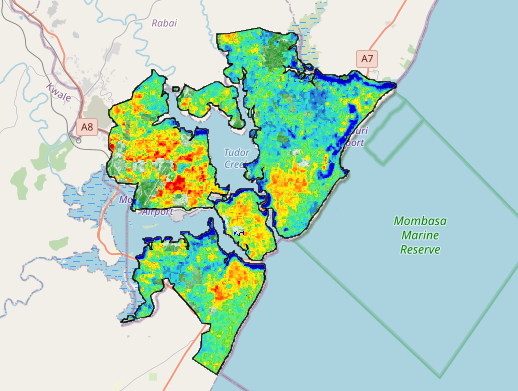

# Mombasa-Urban-Heat-Islands

In this project, I put my newly acquired remote sensing knowledge to the test by visualising Land Surface Temperature values in the city of Mombasa with the aim of analysing Urban Heat Islands. The packages used for this project are geemap, earth engine and rasterio.

## Note
I have ran into an issue of my raster imagery having some missing pixels and I am actively learning how to address this issue by interpolation. Feel free to reach out me if you have a resource to point me to in order to solve this, thanks! My contact is on my profile :).

